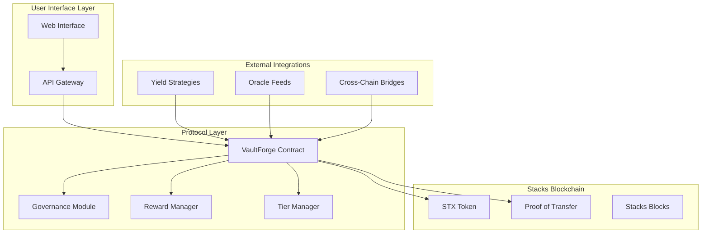
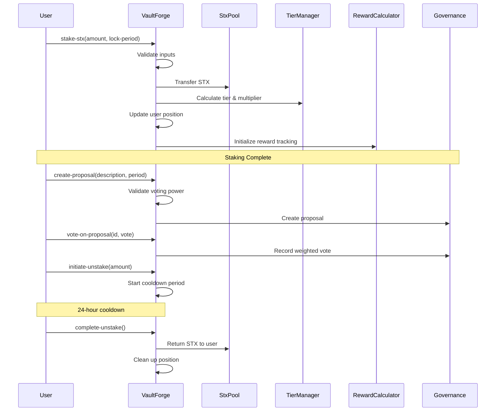

# VaultForge - Next-Generation Liquid Staking & Yield Optimization Platform

[](https://opensource.org/licenses/MIT)
[](https://book.clarity-lang.org/)
[](https://www.stacks.co/)

**Revolutionary DeFi infrastructure delivering automated yield strategies with institutional-grade risk management and community governance.**

## Table of Contents

- [Overview](#overview)
- [System Architecture](#system-architecture)
- [Core Features](#core-features)
- [Smart Contract Architecture](#smart-contract-architecture)
- [Data Flow](#data-flow)
- [Tier System](#tier-system)
- [Getting Started](#getting-started)
- [Usage](#usage)
- [Testing](#testing)
- [Security](#security)
- [Governance](#governance)
- [Contributing](#contributing)
- [License](#license)

## Overview

VaultForge redefines liquid staking by combining algorithmic yield optimization with sophisticated risk management protocols. Built on Stacks' Bitcoin-secured infrastructure, VaultForge offers users seamless access to diversified yield strategies while maintaining full liquidity through synthetic asset generation.

### Core Value Propositions

- **🔄 Liquid Staking Revolution**: Stake STX while maintaining liquidity through wrapped tokens
- **🤖 Algorithmic Yield Optimization**: AI-driven strategies maximizing returns across market cycles
- **🏆 Progressive Tier System**: Bronze/Silver/Gold membership unlocking exclusive benefits
- **🗳️ Decentralized Governance**: Community-driven protocol evolution with quadratic voting
- **🛡️ Enterprise Security**: Multi-signature safeguards with emergency protocol protection
- **₿ Bitcoin-Native Design**: Leveraging Proof of Transfer for unparalleled security

## System Architecture



## Core Features

### Advanced Features

- **Dynamic Reward Calculation**: Compound interest mechanics with tier-based multipliers
- **Time-Weighted Voting Power**: Preventing governance manipulation through stake duration
- **Automated Rebalancing**: Multi-strategy yield optimization across market cycles
- **Compliance-Ready Architecture**: Supporting institutional adoption requirements
- **Cross-Chain Yield Aggregation**: Secure bridge integrations for maximum yield

### Security Features

- **Emergency Pause Mechanism**: Owner-controlled protocol halt capability
- **Cooldown Periods**: 24-hour security delay for unstaking operations
- **Multi-Signature Protection**: Enhanced security for critical operations
- **Comprehensive Error Handling**: 8 distinct error codes for precise debugging

## Smart Contract Architecture

### Core Components

#### 1. Token Management

```clarity
(define-fungible-token ANALYTICS-TOKEN u0)
```

#### 2. State Variables

- **Protocol Controls**: `contract-paused`, `emergency-mode`
- **Economic Parameters**: `stx-pool`, `base-reward-rate`, `minimum-stake`
- **Governance**: `proposal-count`, `cooldown-period`

#### 3. Data Structures

##### User Positions

```clarity
(define-map UserPositions principal {
  total-collateral: uint,
  total-debt: uint,
  health-factor: uint,
  last-updated: uint,
  stx-staked: uint,
  analytics-tokens: uint,
  voting-power: uint,
  tier-level: uint,
  rewards-multiplier: uint,
})
```

##### Staking Positions

```clarity
(define-map StakingPositions principal {
  amount: uint,
  start-block: uint,
  last-claim: uint,
  lock-period: uint,
  cooldown-start: (optional uint),
  accumulated-rewards: uint,
})
```

##### Governance Proposals

```clarity
(define-map Proposals { proposal-id: uint } {
  creator: principal,
  description: (string-utf8 256),
  start-block: uint,
  end-block: uint,
  executed: bool,
  votes-for: uint,
  votes-against: uint,
  minimum-votes: uint,
})
```

### Public Functions

| Function | Description | Access Control |
|----------|-------------|----------------|
| `initialize-contract` | Setup tier configuration | Owner only |
| `stake-stx` | Stake STX with time-lock options | Public |
| `initiate-unstake` | Start unstaking cooldown | Staker only |
| `complete-unstake` | Complete unstaking after cooldown | Staker only |
| `create-proposal` | Create governance proposal | Minimum voting power |
| `vote-on-proposal` | Vote on active proposal | Token holders |
| `pause-contract` | Emergency pause protocol | Owner only |
| `resume-contract` | Resume paused protocol | Owner only |

## Data Flow



## Tier System

VaultForge implements a sophisticated three-tier membership system that rewards long-term commitment:

### Bronze Tier (Entry Level)

- **Minimum Stake**: 1M uSTX (1,000,000 microSTX)
- **Reward Multiplier**: 1.0x (base rate)
- **Features**: Basic staking and governance participation

### Silver Tier (Enhanced)

- **Minimum Stake**: 5M uSTX (5,000,000 microSTX)
- **Reward Multiplier**: 1.5x (50% bonus)
- **Features**: Enhanced yield, priority access to new strategies

### Gold Tier (Premium)

- **Minimum Stake**: 10M uSTX (10,000,000 microSTX)
- **Reward Multiplier**: 2.0x (100% bonus)
- **Features**: Maximum returns, exclusive governance privileges

### Time-Lock Multipliers

- **Flexible Staking**: 1.0x (no lock)
- **1-Month Lock**: 1.25x (25% bonus)
- **2-Month Lock**: 1.5x (50% bonus)

## Getting Started

### Prerequisites

- Node.js (v18 or higher)
- Clarinet CLI
- Stacks wallet for testing

### Installation

1. **Clone the repository**:

```bash
git clone https://github.com/yakinsanya/vault-forge.git
cd vault-forge
```

2. **Install dependencies**:

```bash
npm install
```

3. **Initialize Clarinet**:

```bash
clarinet integrate
```

### Configuration

The project includes network-specific configurations:

- **Development**: `settings/Devnet.toml`
- **Testnet**: `settings/Testnet.toml`
- **Mainnet**: `settings/Mainnet.toml`

## Usage

### Basic Staking

```clarity
;; Stake 1M uSTX with no lock period
(contract-call? .vault-forge stake-stx u1000000 u0)

;; Stake 5M uSTX with 1-month lock for enhanced rewards
(contract-call? .vault-forge stake-stx u5000000 u4320)
```

### Governance Participation

```clarity
;; Create a governance proposal (requires minimum voting power)
(contract-call? .vault-forge create-proposal 
  "Increase base reward rate to 6%" 
  u1440)

;; Vote on proposal #1 (true = for, false = against)
(contract-call? .vault-forge vote-on-proposal u1 true)
```

### Unstaking Process

```clarity
;; Step 1: Initiate unstaking (starts 24-hour cooldown)
(contract-call? .vault-forge initiate-unstake u1000000)

;; Step 2: Complete unstaking (after cooldown period)
(contract-call? .vault-forge complete-unstake)
```

## Testing

### Run Test Suite

```bash
# Run all tests
npm test

# Run tests with coverage and cost analysis
npm run test:report

# Watch mode for continuous testing
npm run test:watch
```

### Check Contract Validity

```bash
# Validate contract syntax and logic
clarinet check

# Or use the npm task
npm run check
```

### Test Structure

```
tests/
├── vault-forge.test.ts    # Main contract tests
├── governance.test.ts     # Governance functionality
├── staking.test.ts        # Staking operations
└── security.test.ts       # Security and edge cases
```

## Security

### Security Measures

1. **Access Controls**: Owner-only functions for critical operations
2. **Input Validation**: Comprehensive parameter checking
3. **Cooldown Periods**: Time delays preventing rapid manipulation
4. **Emergency Controls**: Pause/resume functionality for crisis management
5. **Error Handling**: Detailed error codes for debugging and monitoring

### Error Codes

| Code | Error | Description |
|------|-------|-------------|
| 1000 | `ERR-NOT-AUTHORIZED` | Caller lacks required permissions |
| 1001 | `ERR-INVALID-PROTOCOL` | Invalid protocol parameters |
| 1002 | `ERR-INVALID-AMOUNT` | Invalid amount specified |
| 1003 | `ERR-INSUFFICIENT-STX` | Insufficient STX balance |
| 1004 | `ERR-COOLDOWN-ACTIVE` | Cooldown period is active |
| 1005 | `ERR-NO-STAKE` | No staking position found |
| 1006 | `ERR-BELOW-MINIMUM` | Amount below minimum threshold |
| 1007 | `ERR-PAUSED` | Contract is paused |

### Audit Status

- [ ] Initial security review
- [ ] External security audit
- [ ] Formal verification
- [ ] Bug bounty program

## Governance

### Proposal Process

1. **Creation**: Minimum voting power required (1M voting power)
2. **Voting Period**: Configurable duration (100-2880 blocks)
3. **Execution**: Automatic execution upon successful vote
4. **Validation**: Comprehensive proposal validation

### Voting Mechanics

- **Weight**: Based on staked amount and lock duration
- **Quorum**: Minimum votes required for proposal validity
- **Time-Weighted**: Longer stakes receive higher voting power

## Contributing

We welcome contributions to VaultForge! Please follow these guidelines:

### Development Process

1. Fork the repository
2. Create a feature branch: `git checkout -b feature/amazing-feature`
3. Commit changes: `git commit -m 'Add amazing feature'`
4. Push to branch: `git push origin feature/amazing-feature`
5. Open a Pull Request

### Code Standards

- Follow Clarity best practices
- Include comprehensive tests
- Document all public functions
- Use descriptive variable names
- Add inline comments for complex logic

### Testing Requirements

- All new features must include tests
- Tests must pass before merging
- Coverage should not decrease

## License

This project is licensed under the MIT License - see the [LICENSE](LICENSE) file for details.
